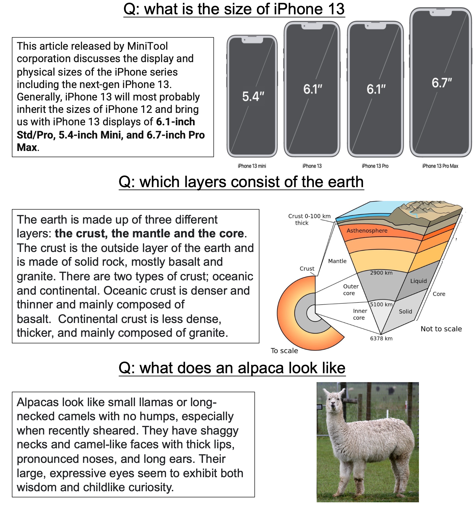

[**中文说明**](./README.zh.md) | [**English**](./README.md)

This repository contains the data, baseline implementations for our CIKM 2022 long paper [ChiQA: A Large Scale Image-based Real-World Question Answering Dataset for Multi-Modal Understanding](https://arxiv.org/abs/2208.03030).

## About ChiQA
### Background
With the development of searching engine, many user queries can be satisfied with multi-modal result, such as images, videos, etc. An example is shown below

     
    
     

### ChiQA
A lot of datasets have been proposed to tackle the visual question answering problem. In most of those datasets, a synthetic or real-world image is provided and human annotators are asked to generate questions with specific focuses, such as entities, relations, or both. However, there are several limitations of these previous VQA datasets. First of all, most of the previous VQA datasets are image-dependent, that is, the questions are asked \textit{after} they see the image, such as a question starts with "Do you see a ... ''. A shortcoming of a context-dependent dataset is that the questions sometimes lack diversity, and models could easily learn the linguistic features merely based on the question and give the answer without understanding the context.
Therefore, we proposed a large-scale Chinese VQA datasets-ChiQA, it has
+ **Real world question**: The questions in ChiQA are open-domain user queries issued to search engine. Real-world queries are diverse since they convey the user's demand for specific information and thus would be either factoid or non-factoid, spanning many types of domains such as medical, health, etc. In addition, real-world queries are image-independent which would be more balanced and unbiased.
+ **Answerability**: The images in ChiQA are also real-world images collected from search engine, which are related to but not necessarily answerable for the question. Answerability is very important and difficult for question answering, it demands a deep understanding of both the question and the context
+ **Unbiased**: Our data crowdsourcing involves a two-phase active learning process. In the first phase, we randomly collect the samples from the web. In the second phase, we first train the model based on the data from the first phase, then we use the trained model to choose the *hard* examples on the remaining data and continue labeling. This two-phase setting makes the data more challenging, and inherently debiasing the unreasonable favoritism towards certain attributes or linguistic patterns in the data.
## prerequisite for running the baselines
`pip install -r requirement.txt`

## Training and inference
An example of training and testing bert-detr model, which utilize the pre-trained language model [BERT](https://arxiv.org/abs/1810.04805) and a SOTA object detection model [DETR](https://arxiv.org/abs/2005.12872) for cross-model representation.   
`sh run_bert_detr.sh -e 5 -p 10 -t 800 -s 200 -l 2e-5 -w 0.1 -n 4`  
arguments：
- e: epochs
- p: print_steps, how many steps to show a log
- t: train_loader_size, batch size per epoch
- s: how many batches should we save the checkpoint.
- l: learning rate
- w: warmup_proportion
- n: num threads to process the data

### BERT+ViT
`sh run_bert_vit.sh -e 5 -p 10 -t 800 -s 200 -l 2e-5 -w 0.1 -n 4`

### ALBEF  
`sh run_albef.sh -e 5 -p 10 -t 800 -s 200 -l 2e-5 -w 0.1 -n 4`  

## Data processing
The raw data of ChiQA will be released soon.